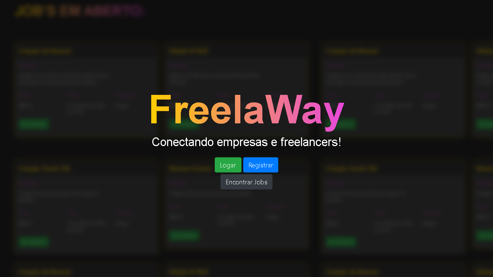
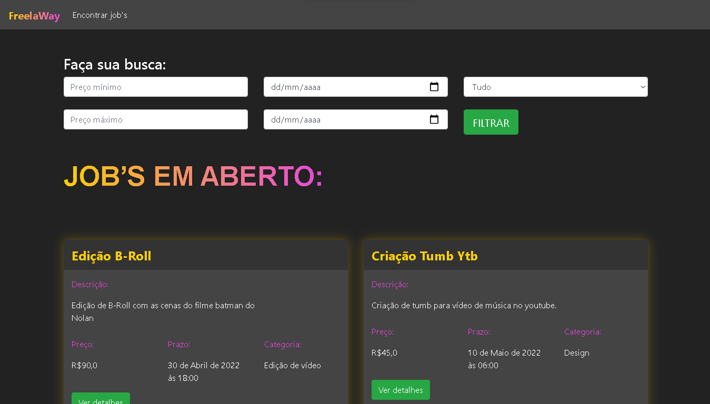
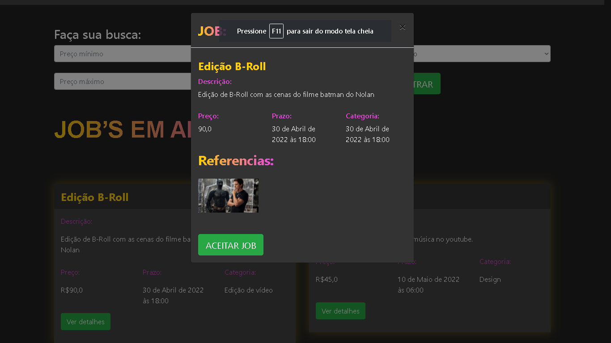
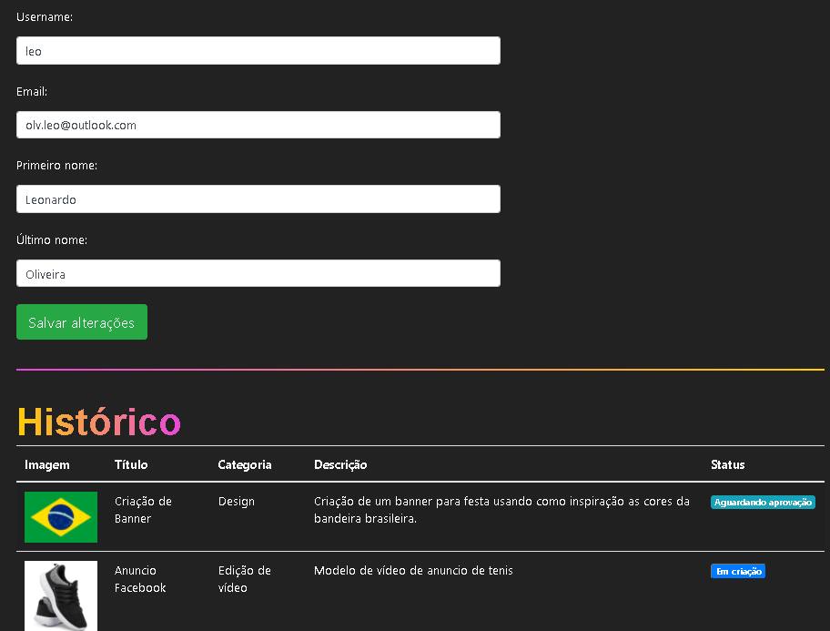

# FreelaWay PSW

## Para instalar

1. Faça um fork do projeto
2. Faça o clone do projeto
3. Instale o pipenv (para criar um ambiente virtual para o projeto)
4. Instale o pjango (Framework que é a base do projeto)
5. Instale o pillow (Biblioteca para trabalhar com imagens)
6. Instale o gunicorn
7. Rode seu servidor

**PS:** Se tiver dificuldade com algum passo da instalação recomendo o
curso [PythonBirds](https://www.python.pro.br/modulos/python-birds/) do [Renzo](https://github.com/renzon)
ele me ajudou muito com Python no geral, mas princípalmente com Github.

## Descrição

A idea da plataforma é conectar empresas que precisam de serviços de design ou edição de vídeo com Freelancers.

A plataforma tem a seguinte página inicial:


Onde o usuário (freelancer) pode acessar sua conta, se registrar ou encontrar vagas.

A empresa cadastra o serviço(Job) que precisa na área administrativa do site que pode ser acessada em:

```localhost/admin```

Cada Job tem as seguintes informações:

- **Título:** Título do Job
- **Descrição:** Texto explicando o que é esperado no Job
- **Categoria:** Design ou Edição de Vídeo
- **Prazo de entrega:** Data e hora limite para a entrega do Job
- **Preço:** Valor que será pago pelo Job
- **Referências:** Imagens de referência
- **Profissional:** O profissional que aceitou o Job (É vazio quando o Job é criado)
- **Status:** Em criação, Aguardando aprovação ou Finalizado
- **Arquivo final:** Arquivo entregue pelo freelance quando finaliza o Job

Quando um Job é cadastrado ele vai para a área de Jobs, onde os freelancers cadastrados na plataforma podem ver todos os
jobs, é possível acessar essa área através do link:

```localhost/jobs/encontrar_jobs```



Nessa área é possível filtrar os Jobs disponíveis por:

- Preço mínimo
- Preço máximo
- Data de entrega
- Categoria

Também é possível clicar no botão "Ver detalhes" de cada um dos Jobs para visualizar um card com mais informações e
também aceitar o Job clicando no botão "ACEITAR JOB":


Uma vez aceito o Job vai para o perfil do usuário, que pode ser acessado no link:

```localhost/jobs/perfil```



No perfil é possível que o usuário altere suas informações de cadastro:

- Usuário
- Email
- Nome
- Sobrenome

**Obs:** O nome de usuário e o email são únicos, ou seja, não pode haver dois usuários com o mesmo username ou o mesmo
email, então antes de fazer a mudança o sistema verifica essas informações

Além disso, ainda na área de perfil, é possível que o usuário veja seu histório com todos os Jobs que já aceitou
mostrando algumas informações gerais sobre os Jobs e também o status de cada um desses Jobs, podendo ser:

- Em criação: Quando o usuário aceitou o Job, mas ainda não finalizou.
- Aguardando aprovação: Quando o usuário já enviou o Job, mas ele ainda não foi analisado.
- Finalizado: Quando o Job enviou o Job e ele foi aprovado pela empresa (que faz isso na área administrativa)

## Próximos passos:

- Criar uma tela inicial para o site
- Modificar a área de perfil e colocar a área de alteração de dados separadas
- Adicionar a opção de mudança de senha para os usuários
- Adicionar o link para o perfil na barra de navegação do site

# Base do projeto

Projeto utilizando Django e Pillow desenvolvido com base no projeto proposto na PYSTACK WEEK 3.0 promovida pelo
canal [Pythonado](https://www.youtube.com/c/pythonando) de 04 a 10 de abril de 2022.
